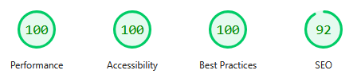

## The goal
I had a couple of different goals in mind when I started planning this project, the most important being that it solved a real need for me.


Most of my previous small-scale projects, especially those made through my studies, have primarily been useful to me as learning experiences.
I mostly enjoyed building them, and naturally I appreciated their educational value, but the final product itself was always, well... _useless_.
Because of this, I was very excited to jump at the opportunity to work on something that felt _real_, and that would actually provide some tangible value for me after it was finished.

That being said, the project also naturally offered a valuable learning experience, as this would be my first real project using JavaScript.
Prior to this, I had almost exclusively been using Java. My experience with JS was limited to a few simple scripts on otherwise static HTML pages, and I had never really sat down to learn the fundamentals
from the bottom up.

At the same time, I knew that this being my first project using JavaScript as the primary language carried with it some risk.
It would have been easy to end up with a messy and slow solution, bogging down the client with cluttered code, resulting in poor performance and long load times. 
Instead, I wanted to focus on keeping the site as lightweight as possible. I am _sure_ that it's possible to build a blazingly fast solution with a framework like React,
but I am equally sure that my first experience with those technologies would not result in one.

Simple & responsive beats flashy & janky.

At that point, I had decided that I wanted a website that could:

 - Display my portfolio of finished projects and work
 - Act as a digital business card of sorts, with contact details and a summary of my profile
 - Give me a place to write about things I am interested in, even when they are not projects in themselves

In addition to these functional requirements, I also had some technical concerns regarding the workflow for writing and publishing posts.
The site needed to support continuous updates with new projects and posts, and while the publishing cadence would not be
high enough to justify using a CMS, I still needed a solution that made it fast and easy to publish new content, preferably without having to touch any code.

## Astro
Going into this project, I had already heard a lot of good things about the [Astro](https://astro.build/) framework, especially for sites like this,
and the more I looked into it, the more it seemed to match what I needed.

Using Astro as a static site generator to render pages at build time meant that a simple web server like [Nginx](https://nginx.org/) could quickly serve static pages to the client with no per-request rendering on either the client or the server.
Its [Content Collections API](https://docs.astro.build/en/reference/modules/astro-content/), together with Zod, also allowed me to easily define collections like `project` and `post` using schemas, resulting in a type-safe workflow,
which made the transition from Java to JavaScript much smoother.

```javascript
const projects = defineCollection({
    loader: glob({ pattern: "**/*.md", base: "./src/content/projects"}),
    schema: ({ image }) => z.object({
        title: z.string(),
        description: z.string(),
        pubDate: z.coerce.date(),
        updateDate: z.coerce.date().optional(),
        ignoreUpdateDate: z.boolean().optional(),
        cover: image(),
        coverAlt: z.string(),
        technologies: z.array(z.string()).optional(),
        links: z.array(z.object({
            url: z.string(),
            name: z.string(),
        })).optional(),
        finished: z.boolean(),
    })
});
```

Defining these collections also meant that I could write posts in the form of simple Markdown files,
while storing their metadata in the frontmatter.

```markdown
---
title: Portfolio/Blog
description: My personal portfolio/blog site
pubDate: 2026-02-01
updateDate: 2026-03-22
cover: './cover.png'
coverAlt: "A screenshot of my personal blog/portfolio"
technologies: [
  'JavaScript',
  'HTML',
  'CSS',
]
links: [
  {
    url: "https://github.com/MaVirgil/MaVirgil.com",
    name: "GitHub"
  }
]
finished: true
---
```

Even with little to no JavaScript experience, getting started using Astro was fairly seamless, thanks in part to their excellent [documentation](https://docs.astro.build/en/getting-started/).
I found myself spending minimal time getting bogged down by unfamiliar syntax or unknown patterns,
and for a project this small, the time it took until I was making key decisions about layout, design, and content was just about perfect.

## An aside about hosting
Going in, I already had some cursory experience with hosting earlier projects on Azure through a free student account, with mixed results. I found the process overly complicated, and the UX rather messy.
While I understand the utility of hyperscalers like Azure or AWS for enterprise applications, and I valued the learning experience, the complexity felt disproportionate to
the project's scope, and it ultimately left me feeling like I was using a bulldozer to pick up a penny.

Instead, I decided to use the project as an opportunity to gain some experience with hosting, server administration, and some networking fundamentals.
That way, I could have full control over what was happening on the server and avoid relying directly on big tech companies, which I have admittedly grown a little weary of in recent years.

I ended up renting a VPS, which turned out to be a good learning experience, and the savings were surprisingly substantial:
for a server like the one I rented from [Hetzner](https://www.hetzner.com) (4 vCPUs | 8 GB RAM) the price I ended up paying was significantly lower than on providers like [DigitalOcean](https://www.digitalocean.com/).

This also left me with a fairly capable server, certainly one that can do more than host a simple static site, which gives me a great excuse to find something
fun to do with it in the future.

## The end result
Moving away from the comfortable and type-safe world of Java felt exciting, albeit a little daunting.
I did occasionally have to take a step back and resist the slightly amateurish temptation of adding flashy but unnecessary components just for their own sake.
Still, I ended up with a solution that I am very satisfied with, and which is just about as fast and responsive as I had hoped.



...and it was fun to work on, which is also nice.

I do expect to continue working on this site through small, incremental improvements,
and there are still aspects of it that I am less happy with: the styling of these posts, for example, still leaves something to be desired.


